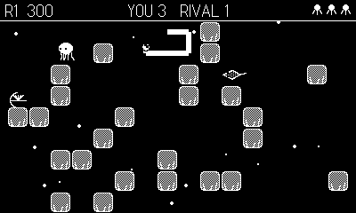

# Clam Jumper

An ocean-bed take on the 1982 arcade game
[Claim Jumper](https://en.wikipedia.org/wiki/Claim_Jumper_(video_game)) —
where a cowboy raced a rival to collect gold bars in a maze, here you pick
one of the reef's real clam specialists and race a rival one to pry pearls
from clams scattered across a coral reef. And yes, the rival will jump your
claim.

**[Read the full player's manual →](MANUAL.md)**

## Play it

Grab a prebuilt `ClamJumper.pdx.zip` from `dist/` (or the GitHub Releases
page), then sideload it at <https://play.date/account/sideload/> or unzip it
and open the `.pdx` in the Playdate Simulator. No toolchain needed.

## Pick your hunter

- **Sea Star** — the grip. Slow, but clams give up easily (shortest crank),
  progress barely bleeds, and a rival bump only halves it. **A clamps down**:
  for a moment nothing can bump you and eels slide right past. The catch:
  it can't hop at all — coral and eels must be walked around or clamped
  through.
- **Octopus** — the jet. Fast, ordinary crank, but progress fades quickly if
  you wander off. **A jet-dashes 3 tiles** over coral or eels and leaves an
  ink puff behind that stuns the rival.
- **Ray** — the glide. **Hold A to glide** over anything for up to 4 tiles,
  landing where you let go — and landing square on a clam wing-slams it
  part-open.

## Controls

- **D-pad** — move around the reef
- **Crank** — pry open the clam you're standing on (a progress ring fills;
  the further you crank, the wider it gapes)
- **A** — your species' ability (dash / glide / clamp), i-frames while
  airborne

## How a reef plays

- Clams are scattered across the maze, each holding one pearl. Stand on a
  clam and crank to pry it open. Finish it and the pearl is yours.
- The **rival** is a random species other than yours each reef, and hunts
  like it: an octopus rival jet-dashes at your clam and inks you, a sea
  star rival is slow but pries fast, a ray rival crosses corridors in
  gliding hops. If you're part-way into a clam it will come and **bump you
  off it** — clamp, outrun it, or beat it to the next shell.
- A **moray eel** patrols the corridors. Touch it and you lose a life —
  but you're untouchable mid-dash or mid-glide, and it slides past a
  clamped sea star.
- Clear every clam to finish the reef. Whoever pried more pearls wins the
  reef bonus. Then it's on to the next, deeper reef: more clams, more
  eels, a faster rival.
- Every second reef is a **Pearl Rain** bonus round — pearls drift down
  the water column and you scoot along the seabed to catch them.

A sparse ocean groove plays under it all (the bass root rises with the
reef), long ability cooldowns tick down as a ring over your head, and the
title screen's wildlife swims laps while you decide. Extra life every
10,000 points. High score (and your last pick) saved on the device.

## Build

Requires the Playdate SDK with `pdc` on PATH.

- `make` — release build to `out/ClamJumper.pdx`
- `make smoke` — instrumented build (autopilot + telemetry); add
  `SMOKE_SPECIES=1|2|3` to force sea star/octopus/ray instead of rotating
  per game
- `tools/smoke.sh [seconds] [until-grep]` — build the smoke variant and
  run it headlessly in the Playdate Simulator
